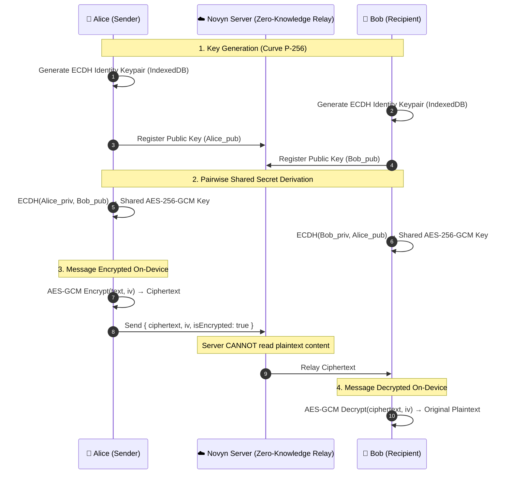

# ⚡ Novyn Chat — Real-Time Encrypted Cross-Platform Messenger

<div align="center">


**A high-performance, real-time messaging platform with WhatsApp-style End-to-End Encryption (E2EE), WebRTC voice/video calling, in-chat mini-games, and a unified architecture across Web & Android.**

[](https://reactjs.org/)
[](https://vitejs.dev/)
[](https://nodejs.org/)
[](https://socket.io/)
[](https://www.mongodb.com/)
[-1192e8.svg)](https://capacitorjs.com/)
[-gold.svg)](https://developer.mozilla.org/en-US/docs/Web/API/Web_Crypto_API)

</div>

---

## 📑 Table of Contents
1. [Architecture & Unified Platform Design](#-architecture--unified-platform-design)
2. [End-to-End Encryption (E2EE) Deep Dive](#-end-to-end-encryption-e2ee-deep-dive)
3. [Feature Showcase](#-feature-showcase)
4. [MongoDB Data Schema (Zero-Knowledge)](#-mongodb-data-schema-zero-knowledge)
5. [Directory & File Structure](#-directory--file-structure)
6. [Quick Start & Local Development](#-quick-start--local-development)
7. [Building for Android (Capacitor)](#-building-for-android-capacitor)
8. [Production Deployment & Environment Variables](#-production-deployment--environment-variables)

---

## 🏛️ Architecture & Unified Platform Design

Novyn Chat uses a **Single-Source Unified Architecture** where the **Web App (Vite + React + TS)** and **Native Android App (Capacitor)** share 100% of the UI components, business logic, WebSocket state, and cryptography engine.

```mermaid
graph TD
    subgraph Client ["📱 Unified Cross-Platform Client"]
        A[🌐 Web Browser] & B[🤖 Native Android Shell (Capacitor)]
        C[⚛️ React 18 + Vite SPA UI]
        D[🔐 Web Crypto API Engine (ECDH P-256 + AES-GCM)]
        E[⚡ Socket.IO Client + WebRTC Manager]
        F[💾 Local IndexedDB KeyStore + Session Cache]
        A --> C
        B --> C
        C --> D
        C --> E
        C --> F
    end

    subgraph Backend ["☁️ Node.js + Express + Socket.IO Server"]
        G[🛡️ Zero-Knowledge Relay & Auth Controller]
        H[📡 WebSocket Event Dispatcher]
        I[📦 Cloudinary / Local Disk Media Engine]
        J[📬 WebPush & SMTP Reset Service]
    end

    subgraph Database ["🗄️ Database & Storage Layer"]
        K[(🍃 MongoDB Atlas / Split Collections)]
        L[📁 uploads/ Storage]
    end

    E <-->|Encrypted Ciphertext & WebRTC Signaling| Backend
    Backend <--> Database
```

### Key Architectural Strengths:
- **Same Data & Identity**: Log in from any browser or your Android phone; your conversations, media, and friendships sync instantly in real-time.
- **Zero Latency (0ms) Switch**: In-memory and IndexedDB local caching renders existing conversations instantly before the server roundtrip completes.
- **Hardware Native Integrations**: Smooth haptics, splash screen control, camera access, and status bar coloring via Capacitor native plugins on mobile.

---

## 🔒 End-to-End Encryption (E2EE) Deep Dive

Novyn Chat features client-side **End-to-End Encryption** modeled after Signal and WhatsApp, powered by the browser's native **Web Crypto API (`window.crypto.subtle`)**.



### Security Highlights:
1. **Private Keys Never Leave Device**: Private keys are generated locally and securely stored in `IndexedDB` (`novyn_e2ee_keystore`).
2. **Zero-Knowledge Backend**: MongoDB only stores Base64 scrambled ciphertext (`ciphertext`) and initialization vectors (`iv`).
3. **60-Digit Safety Number Verification**: In **Contact Details ➔ Encryption (E2EE)**, both users can compare an out-of-band **60-digit numerical fingerprint** (12 blocks of 5 digits) or scan the **Safety QR Code** to verify encryption integrity.

---

## 🌟 Feature Showcase

| Category | Features |
|---|---|
| **💬 Messaging** | • Real-time 1-on-1 & Group Chats<br>• Message Delivery Arrows (`sent`, `delivered`, `seen`)<br>• Draft Auto-Save per conversation (persists across page reloads & tabs)<br>• Swipe-to-Reply & Message Pinning<br>• Unsend & Edit Message Support<br>• In-Chat Search with highlight jumps |
| **🎮 In-Chat Mini Games** | • **Tic-Tac-Toe**: Turn-based board duel inside chat bubbles<br>• **Rock-Paper-Scissors**: Interactive move challenges<br>• **Connect 4**: Grid-based strategy game<br>• Dark slate card design with real-time socket move synchronization |
| **📞 Audio & Video Calling** | • Peer-to-Peer **WebRTC Calling** (Direct DTLS-SRTP encryption)<br>• Crystal-clear voice and HD video streams<br>• Ringtones, call logs, camera flip, and screen sharing |
| **🎙️ Voice Notes** | • Audio recording with live interactive waveform visualizers<br>• Variable playback speed (`1x`, `1.5x`, `2x`) |
| **😀 Reactions & Expressions** | • Quick emoji reaction bar with reaction animations<br>• Sender reactions anchored on left; receiver reactions anchored on right<br>• GIF picker & custom emoji picker |
| **🎨 Customization & Theming** | • Per-chat custom wallpaper selector with instant background synchronization<br>• Modern Glassmorphism aesthetic with theme accent presets<br>• Font sizing and typography selections |
| **📱 Mobile-First UX** | • Fixed mobile bottom navigation bar (`Chats`, `Calls`, `Discover`, `Contacts`, `Settings`)<br>• Responsive sub-settings drill-down with back button headers<br>• Capacitor hardware haptics on taps, reactions, and sends |

---

## 🗄️ MongoDB Data Schema (Zero-Knowledge)

When connected to MongoDB Atlas, Novyn Chat organizes data into high-performance split collections:

### 1. `messages` Collection
```json
{
  "_id": "alex::satyam::msg_1786870000_a8f9",
  "conversationKey": "alex::satyam",
  "messageId": "msg_1786870000_a8f9",
  "from": "satyam",
  "to": "alex",
  "fromKey": "satyam",
  "toKey": "alex",
  "toType": "friend",
  "timestamp": "2026-08-16T09:44:00.000Z",
  "deliveredAt": "2026-08-16T09:44:01.000Z",
  "seenAt": "2026-08-16T09:44:05.000Z",
  
  // 🔒 E2EE Ciphertext (Zero-Knowledge)
  "isEncrypted": true,
  "ciphertext": "8zK9pX2L4mWv/7Qj95aBc...==",
  "iv": "3dF92aK10pX8",
  "text": "[Encrypted Message]"
}
```

### 2. `users` Collection
```json
{
  "_id": "satyam",
  "username": "Satyam",
  "email": "satyam@example.com",
  "displayName": "Satyam",
  "avatarId": "avatar_robot_01",
  "bio": "Building with Novyn Chat",
  "publicKey": "{\"crv\":\"P-256\",\"ext\":true,\"key_ops\":[],\"kty\":\"EC\",\"x\":\"...\",\"y\":\"...\"}",
  "friends": ["alex"],
  "groups": [],
  "presenceMode": "online",
  "isRegistered": true
}
```

### 3. `conversations` Collection
```json
{
  "_id": "alex::satyam",
  "userA": "alex",
  "userB": "satyam",
  "messageCount": 142,
  "lastTimestamp": "2026-08-16T09:44:00.000Z",
  "updatedAt": "2026-08-16T09:44:00.000Z"
}
```

---

## 📂 Directory & File Structure

```text
novyn-chat/
├── android/                         # Capacitor Native Android Project Shell
├── data/                            # Local JSON state fallback (when MongoDB is offline)
├── uploads/                         # Local media uploads directory
├── public/                          # Static assets, sound chimes & PWA icons
├── src/
│   ├── components/
│   │   ├── auth/                    # AuthModal, SignIn/SignUp forms
│   │   ├── calls/                   # CallModal, VideoGrid, CallHistoryPanel
│   │   ├── chat/                    # Core Chat Components
│   │   │   ├── ChatWindow.tsx       # Message viewport, pinning, multi-stage scroll
│   │   │   ├── MessageBubble.tsx    # Message cards, reaction pills, status arrows
│   │   │   ├── MessageInput.tsx     # Text area, draft auto-save, voice recorder
│   │   │   ├── GameMessageBubble.tsx# Tic-Tac-Toe, RPS & Connect 4 mini-game cards
│   │   │   ├── ContactDetailsSidebar.tsx # Contact metadata, media grid, danger zone
│   │   │   ├── VerifySafetyNumberModal.tsx # E2EE 60-digit safety code & QR modal
│   │   │   └── InChatSearch.tsx     # Real-time search & match navigation
│   │   ├── contacts/                # Friend search & request approvals
│   │   ├── layout/                  # AppLayout, Sidebar, BottomNav, CommandPalette
│   │   ├── settings/                # SettingsPanel, SubPanel, SettingsDetailView
│   │   └── ui/                      # Avatars, badges, modals, tooltips
│   ├── context/
│   │   ├── AuthContext.tsx          # JWT session, user registration & login
│   │   └── ChatContext.tsx          # Socket events, E2EE encryption, call managers
│   ├── services/
│   │   ├── e2ee.ts                  # Web Crypto API ECDH P-256 + AES-GCM-256
│   │   ├── webrtc.ts                # Audio/Video P2P WebRTC connection manager
│   │   ├── socket.ts                # Socket.IO connection & reconnect handler
│   │   ├── capacitor.ts             # Native Android haptics & back button listener
│   │   ├── audioManager.ts          # Synthesized chimes & ringtones
│   │   └── settingsTheme.ts         # Theme tokens, custom wallpapers & font presets
│   ├── styles/
│   │   └── index.css                # Glassmorphism, animations, responsive breakpoints
│   └── types/
│       └── index.ts                 # TypeScript type definitions
├── server.js                        # Node.js Express + Socket.IO Server Backend
├── capacitor.config.ts              # Capacitor Android configuration
├── vite.config.ts                   # Vite bundler configuration
└── package.json                     # Scripts and dependencies
```

---

## 🚀 Quick Start & Local Development

### 1. Clone & Install Dependencies
```bash
git clone https://github.com/bysatyam/novyn-chat.git
cd novyn-chat
npm install
```

### 2. Configure Environment (`.env`)
Create a `.env` file in the root directory:
```env
PORT=3000
NODE_ENV=development

# MongoDB Atlas (Optional - defaults to data/chat-state.json)
MONGODB_URI=mongodb+srv://<username>:<password>@cluster.mongodb.net/
MONGODB_DB=novyn

# Email Reset Codes (Optional - via SMTP or Resend)
SMTP_HOST=smtp.resend.com
SMTP_PORT=465
SMTP_SECURE=true
SMTP_USER=resend
SMTP_PASS=your_resend_api_key
SMTP_FROM=Novyn <onboarding@resend.dev>

# Cloudinary Media Storage (Optional - defaults to uploads/)
CLOUDINARY_CLOUD_NAME=your_cloud_name
CLOUDINARY_API_KEY=your_api_key
CLOUDINARY_API_SECRET=your_api_secret
```

### 3. Start Development Server
```bash
npm run dev
```
Open `http://localhost:3000` (or `http://localhost:5173`) in two browser tabs or private windows to test live instant messaging, games, and encrypted calls.

---

## 🤖 Building for Android (Capacitor)

The project includes an **Android Capacitor shell** ready to be compiled into an `.apk` or `.aab`:

```bash
# 1. Build the production web bundle
npm run build

# 2. Sync web bundle and plugins to native Android folder
npm run android:sync

# 3. Open Android Studio to build APK or run on emulator
npm run android:open
```

*Tip: You can also run directly from the terminal if you have Android SDK tools installed:*
```bash
npm run android:run
```

---

## 🌐 Production Deployment & Environment Variables

Deploy to **Render**, **Railway**, **Fly.io**, or any VPS:

1. Connect your GitHub repository to your cloud host.
2. Configure build & start commands:
   - **Build Command**: `npm install && npm run build`
   - **Start Command**: `npm start`
3. Add the following environment variables in your cloud provider's dashboard:
   - `MONGODB_URI` *(MongoDB connection string)*
   - `CLOUDINARY_CLOUD_NAME`, `CLOUDINARY_API_KEY`, `CLOUDINARY_API_SECRET` *(For persistent media uploads)*
   - `UPLOAD_TOKEN_SECRET` *(Stable secret string for signed media URLs)*
   - `CHAT_RETENTION_DAYS` *(Default: 30 days)*

---

<div align="center">

Built with ❤️ by **Satyam** • Powered by **Novyn Technologies**

</div>
